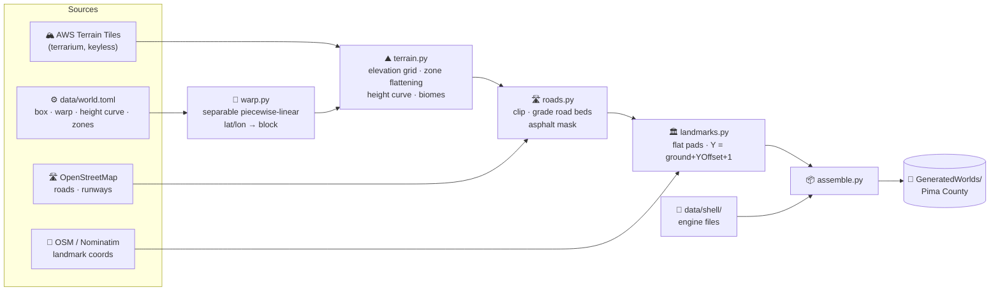

<div align="center">

# 🌵 Pima County — Tucson, AZ for 7 Days to Die

**Real Tucson — real elevation, real roads, real landmarks — rebuilt as a 10240×10240 7 Days to Die world,
for a DayZ × Walking Dead survival run with friends.**


[](#glance)
[](#pipeline)
[](#build)
[](#landmarks)
[](#mode)
[](#roadmap)

</div>

---

<a id="glance"></a>
## 🔭 At a glance

| | |
|---|---|
| 🗺️ **World** | `Pima County` — 10240 × 10240 blocks, north-up |
| 📐 **Extent** | Old Tucson (west wall) → past Mt Lemmon & Summerhaven (NE) → Tucson International (south) |
| ⛰️ **Terrain** | Real DEM, knee height curve: flat basin ≈ 35–48, **Mt Lemmon summit 235** |
| 🛣️ **Roads** | ~9.4k OpenStreetMap ways — I-10, I-19, arterials, collectors, runways, the whole Catalina Hwy drive |
| 📍 **Landmarks** | 20 hand-placed POIs — **Skate Country**, UA, downtown, Davis-Monthan, Old Tucson, Ski Valley, 5 traders |
| 🧪 **Tests** | pytest suite incl. an end-to-end build test |
| 🎮 **Game** | 7 Days to Die V3.2 — no mod needed to play (and none needed to build) |

> [!IMPORTANT]
> Every game-mechanic fact this generator relies on was **verified against the installed game or a real generated world**, never assumed —
> e.g. `dtm.raw` row 0 is **south** while `splat3.png` / `biomes.png` row 0 is **north**, and a prefab's `position` is its footprint's
> **minimum corner** (checked on 1,939 / 1,941 vanilla placements). The design doc logs each finding and how it was checked.

---

<a id="pipeline"></a>
## 🛠️ Pipeline



<details>
<summary><b>📄 What lands in the world folder</b></summary>

| File | Written by | Format (verified) |
|---|---|---|
| `dtm.raw` | `assemble.write_dtm` | little-endian uint16, 10240², value = blocks × 256, **row 0 = south** |
| `splat3.png` | `assemble.write_splat3` | RGBA 10240², asphalt `(255,0,0,255)`, **row 0 = north** |
| `biomes.png` | `assemble.write_biomes` | RGBA at **1/8 scale**, row 0 = north, vanilla biome colors |
| `prefabs.xml` | `assemble.write_prefabs` | `<decoration … position="minX,y,minZ" rotation="0-3"/>` |
| `spawnpoints.xml` | `assemble.write_spawnpoints` | 12 points along I-10 / I-19, ≥ 400 blocks from the edge |
| `main.ttw`, `map_info.xml`, `splat4.png`, `radiation.png` | copied from `data/shell/` | from an empty RWG 10240 world (Towns = Wilderness = None) |

The game builds its own `*_processed` / `*_half` files on first load.

</details>

<details>
<summary><b>🧭 How the scale works</b></summary>

The real area is ~45 × 41 km. Instead of one uniform ratio, each axis has its own **piecewise-linear warp**
(`[real_km, block]` control points in `data/world.toml`): landmark bands (downtown, UA, Old Tucson) get ~2.7 m/block,
Davis-Monthan ~4.3, the Catalinas ~5.4, the Lemmon summit ~3.7. Because the axes are warped independently, Tucson's
N-S / E-W mile grid stays perfectly straight.

Vertically, a **knee curve** `[[650 m, 35], [1000 m, 48], [2800 m, 235]]` keeps the (really flat) basin in a narrow band and
spends the height budget on the mountains.

</details>

---

<a id="build"></a>
## 🚀 Build it

```powershell
pip install -r requirements.txt
python -m pytest -q                 # full suite
python -m tucson.assemble           # -> %APPDATA%\7DaysToDie\GeneratedWorlds\Pima County
```

Then in game: **New Game → World: Pima County**.

> [!WARNING]
> Rebuilding changes terrain under an existing save — old chunks stay cached in the save. **Start a new game** (or delete that world's
> save folder) after every rebuild.

> [!NOTE]
> The first build downloads several hundred DEM tiles and ~9k OSM ways; both are cached under `cache/` (gitignored). The prefab-metadata path in
> `tucson/landmarks.py` (`PREFABS`) points at a Steam library on `G:` — edit it for your install.

<details>
<summary><b>🧰 Other tools</b></summary>

| Command | What it does |
|---|---|
| `python -m tucson.terrain` | warped heightmap + `biomes_source.png` for the Custom Height Map Importer mod (the old mod-based path) |
| `python -m tucson.overlay` | hillshade + zone outlines debug image → `out/world/zones_overlay.png` |
| `python -m tucson.postedit "<world>"` | drops 3 test POIs + an asphalt stripe into a world (orientation / placement check) |

</details>

---

<a id="landmarks"></a>
## 📍 Landmarks

Stand-ins use vanilla prefabs; coordinates come from OpenStreetMap (Overpass / bounded Nominatim) or, where OSM has nothing, a
documented literal. Anything that resolves outside the map is rejected (a "Park Place" once resolved to Oregon).

| | Place | Stand-in prefab |
|---|---|---|
| 🛼 | **Skate Country** — 7980 E 22nd St, south side | `remnant_sports_center_01` *(custom prefab planned)* |
| 🏈 | Arizona Stadium · Old Main · McKale · Banner UMC | `football_stadium` · `school_01` · `school_03` · `hospital_01` |
| 🏙️ | One South Church · Hotel Congress · Fox Theatre · St. Augustine | `skyscraper_01` · `hotel_ostrich` · `theater_stage_01` · `church_01` |
| ✈️ | Davis-Monthan AFB (+ runways) · Tucson International (runways) | `base_military_01` |
| 🤠 | Old Tucson — the west wall | `theater_stage_01` |
| ⛪ | Mission San Xavier del Bac | `church_02` |
| ⛷️ | Mt Lemmon Ski Valley · Summerhaven | `lodge_01` · `cabin_01` · `cabin_04` |
| 💰 | Traders — Tucson Mall · Park Place · El Con · airport · Summerhaven | `trader_bob/jen/joel/hugh/rekt` |

---

<a id="mode"></a>
## 🧟 Game mode — DayZ × The Walking Dead

Built entirely from V3 **Sandbox Options** (no mods):

| Idea | Setting |
|---|---|
| 🌕 Monthly blood moons | `BloodMoonFrequency` |
| ☀️ The dead are more active by day | `ZombieMove` (day) faster than `ZombieMoveNight` |
| 🦌 They eat the game you hunt | `ZombiesEatAnimals` |
| 🎯 Only a headshot finishes them | `HeadshotMode` = Headshot Finisher |
| 🎒 Drop your bag, keep your belt | `DropOnDeath` = Backpack Only |
| 🏪 Traders on — and claimable | `TraderProtection` |
| 🩸 A bite won't kill you… the infection will | low `EntityDamage`, max `InfectionRate` |
| 🧭 No map, keep the compass | `AllowMap` off, `AllowCompass` on |

---

<a id="roadmap"></a>
## 🗺️ Roadmap

- [x] Real DEM terrain, landmark-flattened zones, knee height curve (summit 235)
- [x] Real OSM roads graded into the terrain; whole Mt Lemmon drive on-map
- [x] Direct world assembly — no importer mod / EAC-off loop
- [x] 20 OSM-placed landmarks incl. **Skate Country**
- [ ] In-game landmark walk-through + height-ceiling check at the Ski Valley lodge
- [ ] Custom **Skate Country** prefab
- [ ] Overpasses with bridge prefabs
- [ ] Neighborhoods on the real street grid + the Old Tucson Old West street set
- [ ] Friends' dedicated server + `SandboxCode`

<details>
<summary><b>📚 Docs</b></summary>

- Design + verified-facts log: [`docs/specs/2026-09-24-tucson-map-design.md`](docs/specs/2026-09-24-tucson-map-design.md)
- Plans: [`docs/superpowers/plans/`](docs/superpowers/plans/)

</details>

---

<div align="center">
<sub>
Map data © <a href="https://www.openstreetmap.org/copyright">OpenStreetMap contributors</a> (ODbL) ·
Elevation: <a href="https://registry.opendata.aws/terrain-tiles/">AWS Terrain Tiles</a> ·
7 Days to Die © The Fun Pimps — this is an unofficial fan project.
</sub>
</div>
